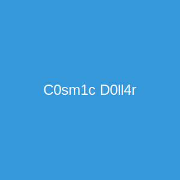

# The Dollar Game: A Graph Theory Odyssey ✨

> *"In the cosmic dance of vertices and edges, we find not merely a game, but a profound meditation on the interconnectedness of all things, man."*

## 🌌 Cosmic Overview

The Dollar Game is a digital implementation of the mathematical chip-firing game, reimagined through the lens of bohemian-tech aesthetics. This application invites you to explore the elegant complexity of graph theory while engaging with a visually captivating interface that balances technical precision with free-spirited energy.

Like the carefully extracted notes of a single-origin Ethiopian pour-over, each vertex in our graph holds unique potential energy in the form of dollars (or debt). Your journey is to achieve harmonic balance by mindfully redistributing this energy until all vertices resonate with positive or neutral vibrations.



## 🧮 Mathematical Foundation

### The Essence of Chip-Firing Games

The Dollar Game is based on the mathematical concept of chip-firing games, a branch of graph theory with connections to:

- **Sandpile models** in statistical physics
- **Divisor theory** in algebraic geometry
- **Laplacian dynamics** on graphs
- **Self-organized criticality** in complex systems

In its purest form, a chip-firing game consists of a graph where each vertex contains some number of chips. Vertices can "fire" when they have at least as many chips as their degree (number of connected edges), distributing one chip along each edge to their neighbors.

### The Genus: Cosmic Harmony Potential

At the heart of our implementation lies the concept of **genus** (also known as the first Betti number in algebraic topology). For a connected graph:

```
Genus = E - V + 1
```

Where:
- E is the number of edges
- V is the number of vertices

The genus represents the maximum number of edges you can remove without disconnecting the graph, or equivalently, the number of independent cycles in the graph. In the context of the Dollar Game:

- A game is **winnable** if and only if the total money in the system is greater than or equal to the genus
- This mathematical truth connects to the Riemann-Roch theorem in algebraic geometry

Our implementation extends the traditional rules by allowing vertices with negative dollars to give, creating a more dynamic and meditative experience.

## 🎬 Inspiration

This project was inspired by the excellent educational video [The Dollar Game](https://www.youtube.com/watch?v=U33dsEcKgeQ), which provides a clear and engaging introduction to this fascinating mathematical concept.

### The Dollar Game: A Mathematical Exploration of Graph Theory

The Dollar Game is a fascinating mathematical puzzle based on chip-firing games in graph theory. Originally introduced by mathematician Matthew Baker, it represents a financial system where vertices (nodes) in a graph can hold positive or negative dollar amounts, representing wealth or debt.

In the Dollar Game, players interact with a graph where each vertex contains some number of dollars (positive) or debt (negative). The goal is to eliminate all debt through strategic moves: either "giving" (where a vertex gives one dollar to each of its neighbors) or "borrowing" (where a vertex takes one dollar from each neighbor). The total amount of money in the system remains constant throughout the game.

What makes this game mathematically significant is its connection to fundamental concepts in graph theory. The game's solvability is directly tied to the graph's genus (or Betti number), calculated as E - V + 1, where E is the number of edges and V is the number of vertices. A key theorem states that a Dollar Game is winnable if and only if the total money in the system is greater than or equal to the graph's genus.

For trees (graphs with no cycles), any non-negative total makes the game winnable. However, for graphs with cycles, having a non-negative total is necessary but not sufficient for winning. The Dollar Game demonstrates connections to algebraic geometry through the Riemann-Roch theorem and provides insights into the mathematical properties of networks and resource distribution.

Beyond its mathematical elegance, the Dollar Game serves as an intuitive model for understanding complex systems where resources flow between interconnected entities, making it relevant to fields ranging from economics to network theory.

## 🚀 Conscious Interaction

### Game Mechanics

1. **Give Energy 🌊**: A vertex shares its essence with all connected neighbors, losing one dollar per connection while each neighbor gains one dollar.

2. **Receive Energy 🌈**: A vertex draws in the collective energy from its neighbors, gaining one dollar per connection while each neighbor loses one dollar.

3. **Winning State ✨**: Achieve universal harmony by ensuring all vertices have zero or positive dollars.

### Algorithmic Consciousness

The game tracks several key metrics:
- **Genus Potential**: The topological complexity of your graph
- **Energy Flow Total**: The sum of all dollars in the system
- **Winnable Status**: Whether cosmic harmony is theoretically achievable

## 💻 Running the Application

### Prerequisites

- Node.js (v14 or higher)
- npm or yarn

### Local Development

```bash
# Install dependencies
pnpm install

# Start the development server
pnpm run dev
```

The application will be available at `http://localhost:5173/`

### Developer Tools

The project includes the following developer tools:

- **Logo Selection CLI Tool**: Located in the `tools/logo-selection` directory - A command-line tool for generating and selecting logo options for the Dollar Game.

#### Using the Logo Selection Tool

The logo selection tool uses Anthropic's Claude AI to generate SVG logos. To use it:

1. Navigate to the tool directory:
   ```bash
   cd tools/logo-selection
   ```

2. Create an `.env` file with your Anthropic API key:
   ```
   ANTHROPIC_API_KEY=your_api_key_here
   ```

3. Run the tool:
   ```bash
   ./logo-select.sh
   ```
   
   Or alternatively:
   ```bash
   pnpm install
   pnpm start
   ```

4. The tool will:
   - Generate 6 SVG logos using Claude AI
   - Create a static HTML page with the logos
   - Open the page in your default browser
   - Prompt you to select a logo in the terminal

5. After viewing the logos in your browser, return to the terminal and enter the number of your preferred logo when prompted.

The logo selection tool handles:
- Generating logo suggestions using Claude AI
- Saving the selected logo to the project
- Updating the README.md with the selected logo

## 🏗️ Project Architecture

The Dollar Game is built with React, TypeScript, and Vite, organized with conscious code structure:

```
/
├── apps/
│   ├── frontend/        # Frontend application
│   │   ├── public/      # Static assets
│   │   ├── scripts/     # Build and utility scripts
│   │   └── src/
│   │       ├── components/  # React components
│   │       │   ├── EdgeComponent.tsx      # Edge visualization
│   │       │   ├── GameControls.tsx       # Game interaction controls
│   │       │   ├── GraphComponent.tsx     # Graph visualization
│   │       │   └── VertexComponent.tsx    # Vertex visualization
│   │       ├── pages/       # Page components
│   │       ├── services/    # Service modules
│   │       ├── App.css      # Styling with bohemian-tech aesthetics
│   │       ├── App.tsx      # Main application component
│   │       ├── gameLogic.ts # Core game mechanics
│   │       ├── index.css    # Global styles
│   │       ├── main.tsx     # Application entry point
│   │       └── types.ts     # TypeScript type definitions
├── tools/
│   └── logo-selection/  # Logo selection CLI tool
├── infrastructure/      # Terraform/OpenTofu infrastructure code
└── design/              # Design documents and resources
```

### Key Components

- **VertexComponent**: Renders vertices with their dollar values and handles user interactions
- **EdgeComponent**: Creates organic, flowing connections between vertices
- **GraphComponent**: Orchestrates the visualization of the entire graph
- **GameControls**: Provides sliders for adjusting vertex density, connection flow, and karma balance

## ☁️ Deployment Harmony

The Dollar Game is deployed using AWS services with OpenTofu (an open-source alternative to Terraform) for infrastructure as code, with GitHub Actions for continuous integration and deployment.

### Infrastructure

The deployment infrastructure includes:
- S3 bucket for website content storage
- CloudFront distribution for content delivery with HTTPS
- ACM certificate for secure HTTPS connections
- Custom domain configuration (dollar-game.firemandecko.com)

### GitHub Actions Workflows

Two separate workflows ensure efficient and targeted deployments:

1. **Infrastructure Deployment Workflow**: Deploys AWS infrastructure using OpenTofu
2. **Application Deployment Workflow**: Builds and deploys the React application to AWS S3

These workflows are triggered based on which files have changed in a commit, ensuring mindful and efficient deployment processes.

## 🎨 Bohemian-Tech Aesthetic

The Dollar Game embraces a unique "l33tc0dzr, l4tt3 drinking, hippy trousers architect in an ivory tower" aesthetic that transcends mere visual design. This holistic approach harmonizes technical precision with bohemian sensibilities.

### Core Principles

- **Authenticity**: Each element radiates genuine expression
- **Conscious Coding**: Acknowledging the interconnectedness of all components
- **Digital Freedom**: Breaking conventional design paradigms
- **Mindful Interaction**: Every user touchpoint feels like a meaningful exchange of energy

For the complete aesthetic consciousness, refer to our [Style Guide](style-guide.md).

## 🔮 Future Vibrations

Potential future enhancements to expand our collective consciousness:

- Enhanced CloudFront caching strategies for optimal performance
- Automated testing before deployment
- Deployment notifications via Slack or email
- Staging environments for pre-production testing
- Additional graph theory visualizations and educational content

## 🧘‍♂️ Concluding Thoughts

The Dollar Game is not merely a web application but a digital manifestation of mathematical beauty and bohemian expression. As you interact with the vertices and edges, remember that each action ripples through the system, much like our own interconnected existence.

Visit us at [dollar-game.firemandecko.com](https://dollar-game.firemandecko.com) to experience the harmony of graph theory in a secure, HTTPS-enabled environment.

May your vertices always be positive, your edges forever flowing, and your code as enlightened as your spirit.

*~ The Cosmic Architect ~*
