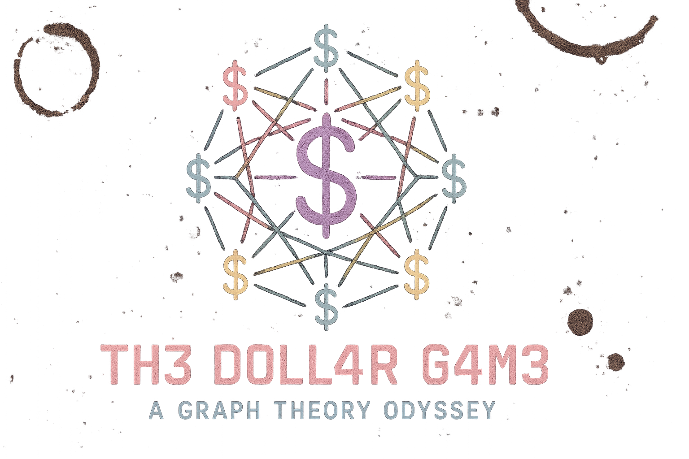

| <div align="left"><h1>The Dollar Game: A Graph Theory Odyssey ✨</h1><p><em>"In the cosmic dance of vertices and edges, we find not merely a game, but a profound meditation on the interconnectedness of all things, man."</em></p></div> | <div align="right"><a href="https://www.buymeacoffee.com/firemandecko" target="_blank"></a></div> |
|---|---|

## 🎬 Inspiration

This project was inspired by the excellent educational video [The Dollar Game](https://www.youtube.com/watch?v=U33dsEcKgeQ), which provides a clear and engaging introduction to this fascinating mathematical concept.

The Dollar Game is a fascinating mathematical puzzle based on chip-firing games in graph theory. Originally introduced by mathematician Matthew Baker, it represents a financial system where vertices (nodes) in a graph can hold positive or negative dollar amounts, representing wealth or debt.

Beyond its mathematical elegance, the Dollar Game serves as an intuitive model for understanding complex systems where resources flow between interconnected entities, making it relevant to fields ranging from economics to network theory.

### First Generation Implementation

The first generation of the Dollar Game application can be seen in this video:

[](https://www.youtube.com/watch?v=mRJUrLD8w9Y)

This initial implementation demonstrates the core concepts of the Dollar Game in a digital format, serving as the foundation for our current more advanced version.



> The logo was generated using AI image generation technology. It embodies the "C0sm1c D0ll4r" concept, representing the transcendental flow of currency through quantum graph space.

## 🚀 Conscious Interaction

### Game Mechanics

1. **Give Energy 🌊**: A vertex shares its essence with all connected neighbors, losing one dollar per connection while each neighbor gains one dollar.

2. **Receive Energy 🌈**: A vertex draws in the collective energy from its neighbors, gaining one dollar per connection while each neighbor loses one dollar.

3. **Winning State ✨**: Achieve universal harmony by ensuring all vertices have zero or positive dollars. When you win, a cosmic starburst animation celebrates your achievement!

4. **Game States**:
   - **Won**: When all vertices have zero or positive dollars, the game is won. All interactivity is disabled, and a celebratory starburst animation appears.
   - **Not Winnable**: When the total money is less than the genus, the game cannot be won. Interactivity is disabled, and a message is displayed.
   - **In Progress**: When the game is in progress and winnable, you can interact with vertices to give or receive energy.

### Algorithmic Consciousness

The game tracks several key metrics:
- **Genus Potential**: The topological complexity of your graph
- **Energy Flow Total**: The sum of all dollars in the system
- **Winnable Status**: Whether cosmic harmony is theoretically achievable

## 💻 Running the Application

### Prerequisites

- Node.js (v14 or higher)
- npm or yarn

### Local Development

```bash
# Install dependencies
pnpm install

# Start the development server
pnpm run dev
```

The application will be available at `http://localhost:5173/`

### Developer Tools

The project includes the following developer tools:

- **Logo Selection CLI Tool**: Located in the `tools/logo-selection` directory - A command-line tool for generating and selecting logo options for the Dollar Game.

#### Logo Generation

The project includes a prompt file for generating logos using AI image generation services:

1. Navigate to the prompt file:
   ```bash
   apps/logo-selection/logo-prompt.md
   ```

2. Use this prompt with an online AI image generation service (like DALL-E, Midjourney, or Claude):
   - The prompt includes detailed specifications for the logo
   - It offers 6 different concept options to choose from
   - It specifies the color palette and style guidelines

3. After generating the logo:
   - Save it as an SVG or PNG file
   - Place it in the `apps/frontend/public/` directory as `selected-logo.svg`
   - The application will automatically display the new logo

The logo selection tool handles:
- Generating logo suggestions using Claude AI
- Saving the selected logo to the project
- Updating the README.md with the selected logo

## 🏗️ Project Architecture

The Dollar Game is built with React, TypeScript, and Vite, organized with conscious code structure:

```
/
├── apps/
│   ├── frontend/        # Frontend application
│   │   ├── public/      # Static assets
│   │   ├── scripts/     # Build and utility scripts
│   │   └── src/
│   │       ├── components/  # React components
│   │       │   ├── EdgeComponent.tsx      # Edge visualization
│   │       │   ├── GameControls.tsx       # Game interaction controls
│   │       │   ├── GraphComponent.tsx     # Graph visualization
│   │       │   └── VertexComponent.tsx    # Vertex visualization
│   │       ├── pages/       # Page components
│   │       ├── services/    # Service modules
│   │       ├── App.css      # Styling with bohemian-tech aesthetics
│   │       ├── App.tsx      # Main application component
│   │       ├── gameLogic.ts # Core game mechanics
│   │       ├── index.css    # Global styles
│   │       ├── main.tsx     # Application entry point
│   │       └── types.ts     # TypeScript type definitions
├── tools/
│   └── logo-selection/  # Logo selection CLI tool
├── infrastructure/      # Terraform/OpenTofu infrastructure code
└── design/              # Design documents and resources
```

### Key Components

- **VertexComponent**: Renders vertices with their dollar values and handles user interactions
- **EdgeComponent**: Creates organic, flowing connections between vertices
- **GraphComponent**: Orchestrates the visualization of the entire graph
- **GameControls**: Provides sliders for adjusting vertex density, connection flow, and karma balance

## ☁️ Deployment Harmony

The Dollar Game is deployed using AWS services with OpenTofu (an open-source alternative to Terraform) for infrastructure as code, with GitHub Actions for continuous integration and deployment.

### Current Infrastructure

The deployment infrastructure now includes:
- S3 bucket for website content storage
- CloudFront distribution for global content delivery with HTTPS
- ACM certificate for secure SSL/TLS connections
- Route53 for DNS management
- Custom domain configuration (dollar-game.firemandecko.com)

The application is accessible at https://dollar-game.firemandecko.com

See [infrastructure-plan.md](infrastructure-plan.md) for the detailed implementation plan.

### GitHub Actions Workflows

Two separate workflows ensure efficient and targeted deployments:

1. **Infrastructure Deployment Workflow**: Deploys AWS infrastructure using OpenTofu
2. **Application Deployment Workflow**: Builds and deploys the React application to AWS S3

These workflows are triggered based on which files have changed in a commit, ensuring mindful and efficient deployment processes.

For more details on the GitHub Actions architecture, see [github-actions-architecture.md](github-actions-architecture.md).

## 🌌 Cosmic Overview

The Dollar Game is a digital implementation of the mathematical chip-firing game, reimagined through the lens of bohemian-tech aesthetics. This application invites you to explore the elegant complexity of graph theory while engaging with a visually captivating interface that balances technical precision with free-spirited energy.

Like the carefully extracted notes of a single-origin Ethiopian pour-over, each vertex in our graph holds unique potential energy in the form of dollars (or debt). Your journey is to achieve harmonic balance by mindfully redistributing this energy until all vertices resonate with positive or neutral vibrations.

## 🧮 Mathematical Foundation

For a detailed exploration of the mathematical concepts behind the Dollar Game, see [mathematical-foundation.md](mathematical-foundation.md).

In brief, the Dollar Game is based on chip-firing games in graph theory, with connections to:

- **Sandpile models** in statistical physics
- **Divisor theory** in algebraic geometry
- **Laplacian dynamics** on graphs
- **Self-organized criticality** in complex systems

The key concept is the **genus** (first Betti number), calculated as `E - V + 1`, where E is the number of edges and V is the number of vertices. A game is winnable if and only if the total money in the system is greater than or equal to the genus.

## 🎨 Bohemian-Tech Aesthetic

The Dollar Game embraces a unique "l33tc0dzr, l4tt3 drinking, hippy trousers architect in an ivory tower" aesthetic that transcends mere visual design. This holistic approach harmonizes technical precision with bohemian sensibilities.

For the complete aesthetic consciousness, refer to our [Style Guide](style-guide.md).

## 🔮 Future Vibrations

Potential future enhancements to expand our collective consciousness:

- Enhanced CloudFront caching strategies for optimal performance
- Automated testing before deployment
- Deployment notifications via Slack or email
- Staging environments for pre-production testing
- Additional graph theory visualizations and educational content
- Progressive Web App (PWA) implementation for offline capabilities

## 🧘‍♂️ Concluding Thoughts

The Dollar Game is not merely a web application but a digital manifestation of mathematical beauty and bohemian expression. As you interact with the vertices and edges, remember that each action ripples through the system, much like our own interconnected existence.

Visit us at [dollar-game.firemandecko.com](https://dollar-game.firemandecko.com) to experience the harmony of graph theory through secure cosmic vibrations.

May your vertices always be positive, your edges forever flowing, and your code as enlightened as your spirit.

*~ The Cosmic Architect ~*
