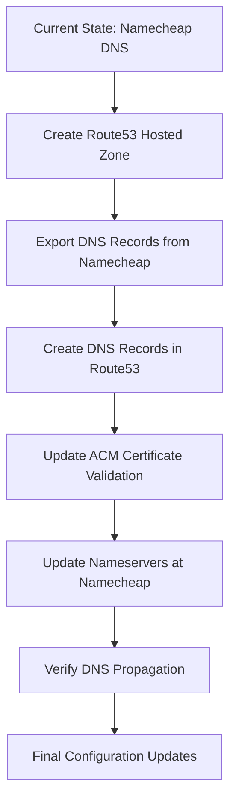

# DNS Migration Plan: Namecheap to AWS Route53

## Overview

This document outlines the plan for migrating DNS management from Namecheap to AWS Route53 while maintaining domain registration with Namecheap. This migration will facilitate SSL setup for the Dollar Game application through AWS Certificate Manager (ACM) and CloudFront.



## 1. Step-by-Step Migration Guide

### Phase 1: Preparation and Setup

#### 1.1 Create Route53 Hosted Zone
- Create a public hosted zone in Route53 for `firemandecko.com`
- AWS will assign four unique nameservers to your hosted zone, typically in this format:
  ```
  ns-XXXX.awsdns-XX.com
  ns-XXXX.awsdns-XX.net
  ns-XXXX.awsdns-XX.org
  ns-XXXX.awsdns-XX.co.uk
  ```
- These nameservers will be used to update the domain configuration at Namecheap

#### 1.2 Export DNS Records from Namecheap
- Log in to Namecheap account
- Go to Domain List > Manage > Advanced DNS
- Document all existing DNS records:
  - A records
  - CNAME records
  - MX records
  - TXT records (including SPF)
  - Any other records

#### 1.3 Create DNS Records in Route53
- Create all the DNS records exported from Namecheap in the Route53 hosted zone
- Include:
  - A records for apex domain pointing to CloudFront
  - CNAME records for www subdomain
  - MX records for email
  - TXT records for SPF
  - ACM certificate validation records

#### 1.4 Update ACM Certificate Configuration
- Modify the ACM certificate configuration to use Route53 for DNS validation
- Add the `aws_route53_record` resources for certificate validation

### Phase 2: Migration

#### 2.1 Update Nameservers at Namecheap
- Log in to Namecheap account
- Go to Domain List > Manage > Domain
- Select "Custom DNS" and enter the Route53 nameservers (the four nameservers assigned by AWS)
- Save changes

#### 2.2 Verify DNS Propagation
- Use tools like `dig`, `nslookup`, or online DNS checkers
- Verify that queries for `firemandecko.com` return the correct records
- Check that the website and email services continue to function
- DNS propagation can take up to 48 hours, but often completes within a few hours

### Phase 3: Post-Migration

#### 3.1 Update CloudFront and SSL Configuration
- Update the CloudFront and SSL configurations to use Route53 for automatic validation
- Apply the Terraform changes

#### 3.2 Verify SSL Certificate
- Ensure the ACM certificate is still valid
- Verify HTTPS access to the website

## 2. Terraform Code for Route53 Configuration

Create a new file `infrastructure/route53.tf` with the following content:

```hcl
# Route53 Hosted Zone for firemandecko.com
resource "aws_route53_zone" "primary" {
  name = "firemandecko.com"
  
  tags = {
    Name        = "firemandecko-com-zone"
    Environment = "production"
  }
}

# Output the nameservers assigned by AWS
output "nameservers" {
  value       = aws_route53_zone.primary.name_servers
  description = "The nameservers assigned to the Route53 hosted zone"
}

# A record for apex domain pointing to CloudFront
resource "aws_route53_record" "apex" {
  zone_id = aws_route53_zone.primary.zone_id
  name    = "firemandecko.com"
  type    = "A"
  
  alias {
    name                   = aws_cloudfront_distribution.website_distribution[0].domain_name
    zone_id                = aws_cloudfront_distribution.website_distribution[0].hosted_zone_id
    evaluate_target_health = false
  }
}

# Note: www.firemandecko.com record has been removed

# A record for dollar-game subdomain
resource "aws_route53_record" "dollar_game" {
  zone_id = aws_route53_zone.primary.zone_id
  name    = "dollar-game.firemandecko.com"
  type    = "A"
  
  alias {
    name                   = aws_cloudfront_distribution.website_distribution[0].domain_name
    zone_id                = aws_cloudfront_distribution.website_distribution[0].hosted_zone_id
    evaluate_target_health = false
  }
}

# CNAME record for www.dollar-game subdomain
resource "aws_route53_record" "www_dollar_game" {
  zone_id = aws_route53_zone.primary.zone_id
  name    = "www.dollar-game.firemandecko.com"
  type    = "CNAME"
  ttl     = 300
  records = [aws_cloudfront_distribution.website_distribution[0].domain_name]
}

# MX records for email
resource "aws_route53_record" "mx" {
  zone_id = aws_route53_zone.primary.zone_id
  name    = "firemandecko.com"
  type    = "MX"
  ttl     = 3600
  records = [
    "10 mx1.namecheap.com",
    "20 mx2.namecheap.com"
  ]
}

# TXT record for SPF
resource "aws_route53_record" "spf" {
  zone_id = aws_route53_zone.primary.zone_id
  name    = "firemandecko.com"
  type    = "TXT"
  ttl     = 3600
  records = ["v=spf1 include:spf.efwd.registrar-servers.com ~all"]
}

# ACM Certificate DNS Validation Records
resource "aws_route53_record" "cert_validation" {
  for_each = {
    for dvo in aws_acm_certificate.cert.domain_validation_options : dvo.domain_name => {
      name   = dvo.resource_record_name
      record = dvo.resource_record_value
      type   = dvo.resource_record_type
    }
  }

  zone_id = aws_route53_zone.primary.zone_id
  name    = each.value.name
  type    = each.value.type
  ttl     = 60
  records = [each.value.record]
}

# Certificate Validation
resource "aws_acm_certificate_validation" "cert" {
  provider                = aws.us_east_1
  certificate_arn         = aws_acm_certificate.cert.arn
  validation_record_fqdns = [for record in aws_route53_record.cert_validation : record.fqdn]
}
```

## 3. Updates to Existing Infrastructure Code

### 3.1 Update ssl.tf

Modify the `infrastructure/ssl.tf` file to integrate with Route53 for automatic validation:

```hcl
# Phase 1: ACM Certificate for dollar-game.firemandecko.com
resource "aws_acm_certificate" "cert" {
  domain_name               = "dollar-game.firemandecko.com"
  subject_alternative_names = ["www.dollar-game.firemandecko.com"]
  validation_method         = "DNS"
  
  # ACM certificates for CloudFront must be in us-east-1 region
  provider = aws.us_east_1
  
  lifecycle {
    create_before_destroy = true
  }
  
  tags = {
    Name        = "dollar-game-certificate"
    Environment = "production"
  }
}

# CloudFront Origin Access Identity to secure S3 bucket
resource "aws_cloudfront_origin_access_identity" "oai" {
  comment = "OAI for dollar-game.firemandecko.com"
}

# Output the certificate validation records
output "certificate_validation_records" {
  value = {
    for dvo in aws_acm_certificate.cert.domain_validation_options : dvo.domain_name => {
      name   = dvo.resource_record_name
      type   = dvo.resource_record_type
      value  = dvo.resource_record_value
    }
  }
  description = "DNS records needed for certificate validation"
}

output "acm_certificate_arn" {
  value       = aws_acm_certificate.cert.arn
  description = "ARN of the ACM certificate"
}

output "custom_domain" {
  value       = "https://dollar-game.firemandecko.com"
  description = "Custom domain with HTTPS (will be available after CloudFront setup)"
}
```

### 3.2 Update variables.tf

Add the following variables to `infrastructure/variables.tf`:

```hcl
# Variable to control whether to apply CloudFront configuration
# Set to false initially, then set to true after certificate validation
variable "apply_cloudfront" {
  description = "Whether to apply CloudFront configuration (set to true after certificate validation)"
  type        = bool
  default     = false
}

# Variable for the root domain name
variable "root_domain_name" {
  description = "The root domain name for the website"
  type        = string
  default     = "firemandecko.com"
}

# Variable for the full domain name
variable "domain_name" {
  description = "The full domain name for the website"
  type        = string
  default     = "dollar-game.firemandecko.com"
}
```

## 4. GitHub Actions Workflow Updates

Update the `.github/workflows/deploy-infrastructure.yml` file to add steps for handling Route53 and DNS validation:

```yaml
# Add this to the env section
env:
  TOFU_VERSION: '1.6.0'
  AWS_PAGER: ""
  CERTIFICATE_VALIDATION_TIMEOUT: "1800"  # 30 minutes timeout for certificate validation
  DNS_PROPAGATION_CHECK_TIMEOUT: "1800"   # 30 minutes timeout for DNS propagation check

# Add this step after the "Apply OpenTofu" step
- name: Display Route53 Nameservers
  working-directory: ./infrastructure
  run: |
    echo "Route53 Nameservers for firemandecko.com:"
    tofu output -json nameservers | jq -r '.[]'
    echo "Please update these nameservers at your domain registrar (Namecheap)"

# Update the "Wait for certificate validation" step
- name: Wait for certificate validation
  working-directory: ./infrastructure
  run: |
    echo "Waiting for ACM certificate validation..."
    # Get the certificate ARN
    CERT_ARN=$(tofu output -raw acm_certificate_arn 2>/dev/null || echo "")
    
    if [ -n "$CERT_ARN" ]; then
      # Wait for certificate validation (timeout after 30 minutes)
      TIMEOUT=${{ env.CERTIFICATE_VALIDATION_TIMEOUT }}
      START_TIME=$(date +%s)
      
      while true; do
        # Check certificate status
        STATUS=$(aws acm describe-certificate --certificate-arn "$CERT_ARN" --query 'Certificate.Status' --output text)
        
        if [ "$STATUS" = "ISSUED" ]; then
          echo "Certificate validated successfully!"
          break
        fi
        
        # Check timeout
        CURRENT_TIME=$(date +%s)
        ELAPSED_TIME=$((CURRENT_TIME - START_TIME))
        if [ $ELAPSED_TIME -gt $TIMEOUT ]; then
          echo "Certificate validation timed out after $TIMEOUT seconds"
          echo "Please check the ACM console and validate the certificate manually"
          break
        fi
        
        echo "Certificate status: $STATUS. Waiting..."
        sleep 60
      done
    else
      echo "Certificate ARN not found. Skipping validation wait."
    fi

# Add this step to check DNS propagation
- name: Check DNS Propagation
  working-directory: ./infrastructure
  run: |
    echo "Checking DNS propagation..."
    # Get the domain name
    DOMAIN=$(tofu output -raw domain_name 2>/dev/null || echo "firemandecko.com")
    
    # Wait for DNS propagation (timeout after 30 minutes)
    TIMEOUT=${{ env.DNS_PROPAGATION_CHECK_TIMEOUT }}
    START_TIME=$(date +%s)
    
    while true; do
      # Check if DNS is resolving correctly
      if dig +short $DOMAIN | grep -q "cloudfront.net"; then
        echo "DNS propagation complete for $DOMAIN!"
        break
      fi
      
      # Check timeout
      CURRENT_TIME=$(date +%s)
      ELAPSED_TIME=$((CURRENT_TIME - START_TIME))
      if [ $ELAPSED_TIME -gt $TIMEOUT ]; then
        echo "DNS propagation check timed out after $TIMEOUT seconds"
        echo "Please check DNS resolution manually"
        break
      fi
      
      echo "DNS still propagating for $DOMAIN. Waiting..."
      sleep 60
    done
```

## 5. AWS Nameservers

When you create a Route53 hosted zone for your domain in AWS, AWS will assign a set of four unique nameservers to that hosted zone. These nameservers typically follow this format:

```
ns-XXXX.awsdns-XX.com
ns-XXXX.awsdns-XX.net
ns-XXXX.awsdns-XX.org
ns-XXXX.awsdns-XX.co.uk
```

The exact nameservers are assigned when you create the hosted zone and will be unique to your domain. You can find these nameservers in several ways:

1. **In the AWS Console:**
   - Go to the Route53 service
   - Click on "Hosted zones"
   - Select your domain's hosted zone
   - The nameservers will be listed in the "Name servers" section

2. **Using AWS CLI:**
   ```bash
   aws route53 get-hosted-zone --id YOUR_HOSTED_ZONE_ID
   ```

3. **In Terraform:**
   After creating the hosted zone with Terraform, you can access the nameservers using:
   ```hcl
   output "nameservers" {
     value = aws_route53_zone.primary.name_servers
   }
   ```

Once you have these nameservers, you'll need to update your domain's nameserver settings at Namecheap to point to these AWS nameservers. This is a critical step in the DNS migration process, as it delegates DNS management from Namecheap to AWS Route53.

## 6. Timeline and Risk Mitigation

### Timeline
- Day 1: Create Route53 hosted zone and export DNS records from Namecheap
- Day 2: Create DNS records in Route53 and update ACM certificate configuration
- Day 3: Update nameservers at Namecheap and begin DNS propagation monitoring
- Day 4-5: Verify DNS propagation and SSL certificate validation
- Day 6-7: Final configuration updates and testing

### Risk Mitigation
1. **DNS Propagation Delays**
   - Risk: DNS changes may take time to propagate globally
   - Mitigation: Plan for a 24-48 hour transition period, implement monitoring

2. **Email Service Disruption**
   - Risk: MX records might not be correctly transferred
   - Mitigation: Double-check MX record configuration, test email delivery before and after migration

3. **SSL Certificate Validation Issues**
   - Risk: ACM certificate validation might fail with new DNS configuration
   - Mitigation: Ensure validation records are correctly created in Route53

4. **Nameserver Configuration Errors**
   - Risk: Incorrect nameserver configuration at Namecheap
   - Mitigation: Double-check nameserver entries, use DNS lookup tools to verify

5. **Terraform State Conflicts**
   - Risk: Conflicts between existing and new infrastructure code
   - Mitigation: Use Terraform workspaces or careful state management

## 7. Conclusion

This DNS migration plan provides a comprehensive approach to moving DNS management from Namecheap to AWS Route53 while maintaining domain registration with Namecheap. The migration will enable better integration with AWS services, particularly for SSL certificate validation through ACM, which will streamline the HTTPS setup for the Dollar Game application.

By following this plan, you'll be able to:
1. Create a Route53 hosted zone for your domain
2. Migrate all existing DNS records from Namecheap to Route53
3. Update the nameservers at Namecheap to point to AWS Route53
4. Configure automatic certificate validation through Route53
5. Ensure a smooth transition with minimal downtime

After completing this migration, you'll have a fully integrated AWS infrastructure with Route53 handling DNS, ACM providing SSL certificates, and CloudFront delivering your content securely over HTTPS.