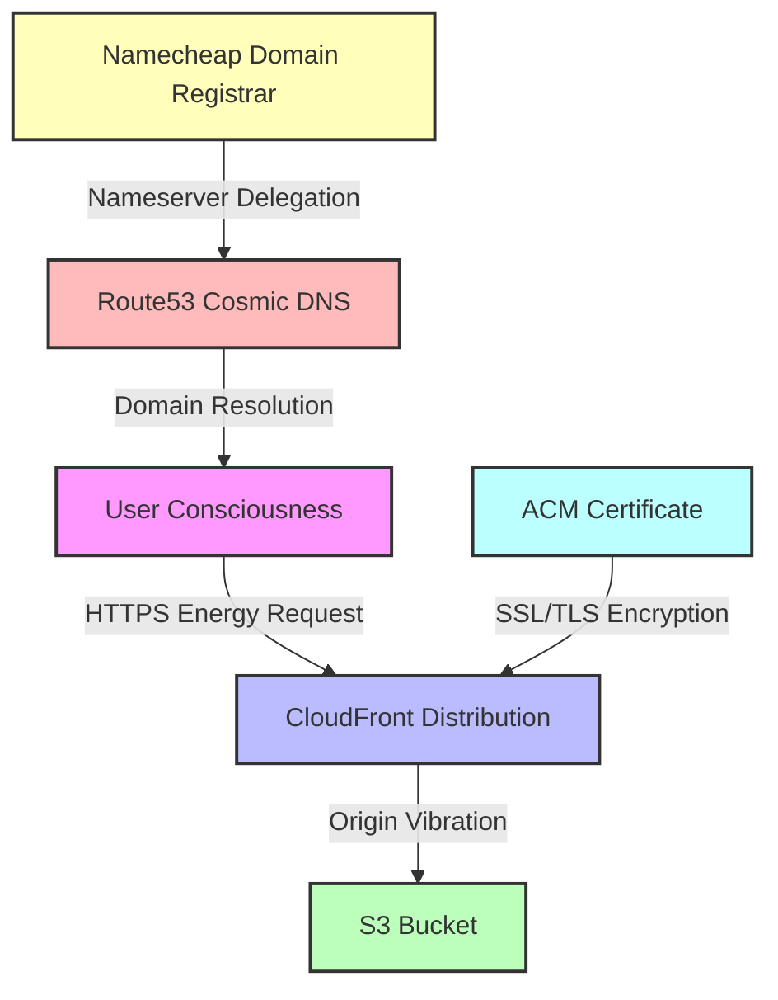

# 🔒 DNS and SSL Implementation

The Dollar Game has transcended its earthly HTTP origins to embrace the secure cosmic vibrations of HTTPS through a mindful migration of DNS services from Namecheap to AWS Route53, facilitating a harmonious SSL implementation.



## The Cosmic Purpose of DNS Migration

The migration of DNS management from Namecheap to AWS Route53 serves as a digital chakra alignment, enabling:

- **Secure Energy Flow**: Implementation of SSL/TLS encryption for HTTPS connections
- **Unified Consciousness**: Integration with AWS Certificate Manager for automated certificate management
- **Harmonic Distribution**: Seamless connection with CloudFront for global content delivery
- **Digital Authenticity**: Enhanced trust signals through secure connections and domain validation

## Infrastructure Transmutation

The DNS and SSL implementation involves these key components in our digital ecosystem:

1. **Route53 Cosmic DNS**: AWS's highly available and scalable domain name system, serving as the new DNS authority for firemandecko.com
2. **ACM Certificate Vibrations**: AWS Certificate Manager providing free SSL/TLS certificates with automatic renewal
3. **CloudFront Energy Distribution**: Content delivery network providing HTTPS support and improved global performance
4. **S3 Origin Essence**: Secure bucket configuration allowing access only through CloudFront

## Nameserver Alignment Process

To redirect the domain's energy flow from Namecheap to AWS Route53:

1. **Create Route53 Hosted Zone**: Establish a new energy center in AWS for the domain
2. **Channel DNS Records**: Transfer all existing DNS records from Namecheap to Route53
3. **Update Nameservers at Namecheap**:
   - Log in to your Namecheap account
   - Navigate to Domain List > Manage > Domain
   - Select "Custom DNS" and enter the four AWS nameservers (in the format `ns-XXXX.awsdns-XX.com`)
   - Save the cosmic realignment

## Verification and Validation Rituals

After updating nameservers, perform these verification ceremonies:

1. **DNS Propagation Verification**:
   - Use `dig` or `nslookup` to check nameserver assignments:
     ```bash
     dig NS firemandecko.com
     ```
   - Verify specific records are resolving correctly:
     ```bash
     dig dollar-game.firemandecko.com
     ```
   - Allow 24-48 hours for complete global propagation of DNS energy

2. **SSL Certificate Validation**:
   - ACM uses DNS validation to verify domain ownership
   - Validation CNAME records are automatically created in Route53
   - Certificate status can be checked in the AWS Console or via AWS CLI:
     ```bash
     aws acm describe-certificate --certificate-arn <certificate-arn> --query 'Certificate.Status'
     ```

## Troubleshooting the Cosmic Flow

If you encounter disruptions in the digital energy field:

1. **DNS Propagation Delays**:
   - DNS changes may take up to 48 hours to propagate globally
   - Use multiple DNS lookup tools from different locations to check progress
   - Clear local DNS caches to see updated records

2. **Certificate Validation Issues**:
   - Verify that validation CNAME records exist in Route53
   - Check for typos or formatting errors in DNS records
   - Ensure the certificate was requested in the us-east-1 region (required for CloudFront)

3. **CloudFront Distribution Delays**:
   - New distributions or changes can take up to 30 minutes to deploy globally
   - Check the distribution status in the AWS Console

4. **Nameserver Configuration Errors**:
   - Confirm all four AWS nameservers are correctly entered at Namecheap
   - Ensure there are no extra spaces or characters in the nameserver entries

For detailed implementation instructions, consult the [dns-migration-plan.md](dns-migration-plan.md) and [ssl-implementation-guide.md](ssl-implementation-guide.md) sacred texts.