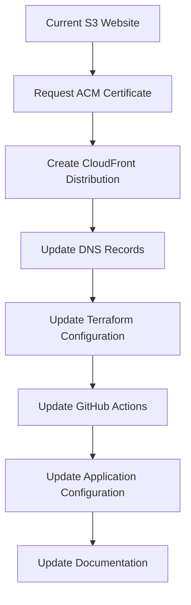
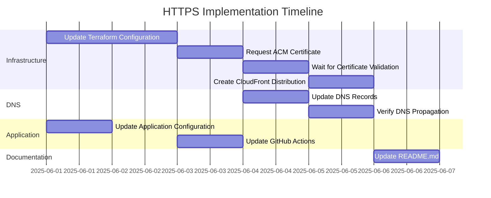

# HTTPS Implementation Plan for Dollar Game (Future Implementation)

## Overview

This document outlines the plan for implementing HTTPS with AWS Certificate Manager (ACM) certificates for the Dollar Game project, transitioning from the current S3 website to a secure CloudFront distribution with a custom domain. **This is a plan for future implementation and has not yet been executed.**

## Current Infrastructure

The Dollar Game is currently:
- A React application hosted in an S3 bucket (dollar-game-firemandecko)
- Accessible via http://dollar-game-firemandecko.s3-website-us-east-1.amazonaws.com
- Deployed using GitHub Actions workflows
- Infrastructure defined with Terraform/OpenTofu

## Target Infrastructure

We'll enhance this to:
- Use the domain name dollar-game.firemandecko.com
- Serve the website over HTTPS using an ACM certificate
- Distribute content via CloudFront for improved performance and HTTPS support
- Maintain the existing deployment workflows with necessary updates

## Implementation Plan



### 1. Request ACM Certificate

1. Add Terraform configuration to request an ACM certificate for dollar-game.firemandecko.com
2. Include both the primary domain (dollar-game.firemandecko.com) and www subdomain (www.dollar-game.firemandecko.com)
3. Configure DNS validation for the certificate
4. Ensure the certificate is requested in the us-east-1 region (required for CloudFront)

### 2. Create CloudFront Distribution

1. Add Terraform configuration for a CloudFront distribution
2. Configure the S3 bucket as the origin
3. Set up the ACM certificate for HTTPS
4. Configure default behaviors (caching, forwarding, etc.)
5. Set up proper error handling for SPAs (redirect to index.html)

### 3. Update DNS Records

1. Identify the necessary DNS records to point dollar-game.firemandecko.com to the CloudFront distribution
2. Document the required changes for your external DNS provider
3. Include both A records for the domain and CNAME for www subdomain

### 4. Update Terraform Configuration

1. Modify the existing infrastructure code to include the new resources
2. Update outputs to include the new CloudFront URL and domain information
3. Ensure backward compatibility during the transition

### 5. Update GitHub Actions Workflow

1. Update the deploy-infrastructure.yml workflow to handle the new resources
2. Ensure proper sequencing of operations (certificate validation before CloudFront creation)
3. Add steps to verify the HTTPS setup after deployment

### 6. Update Application Configuration

1. Update any hardcoded URLs in the application to use the new domain
2. Ensure all assets are loaded over HTTPS
3. Implement proper redirects from HTTP to HTTPS if needed

### 7. Update Documentation

1. Update README.md with the new domain information
2. Document the HTTPS implementation
3. Update any deployment instructions

## Detailed Technical Implementation

### 1. ACM Certificate Configuration

```hcl
resource "aws_acm_certificate" "cert" {
  domain_name               = "dollar-game.firemandecko.com"
  subject_alternative_names = ["www.dollar-game.firemandecko.com"]
  validation_method         = "DNS"

  lifecycle {
    create_before_destroy = true
  }
}

output "certificate_validation_records" {
  value = aws_acm_certificate.cert.domain_validation_options
  description = "DNS records needed for certificate validation"
}
```

### 2. CloudFront Distribution Configuration

```hcl
resource "aws_cloudfront_distribution" "website_distribution" {
  origin {
    domain_name = aws_s3_bucket.website_bucket.bucket_regional_domain_name
    origin_id   = "S3-${aws_s3_bucket.website_bucket.bucket}"
  }

  enabled             = true
  is_ipv6_enabled     = true
  default_root_object = "index.html"
  aliases             = ["dollar-game.firemandecko.com", "www.dollar-game.firemandecko.com"]

  default_cache_behavior {
    allowed_methods  = ["GET", "HEAD"]
    cached_methods   = ["GET", "HEAD"]
    target_origin_id = "S3-${aws_s3_bucket.website_bucket.bucket}"

    forwarded_values {
      query_string = false
      cookies {
        forward = "none"
      }
    }

    viewer_protocol_policy = "redirect-to-https"
    min_ttl                = 0
    default_ttl            = 3600
    max_ttl                = 86400
  }

  custom_error_response {
    error_code         = 404
    response_code      = 200
    response_page_path = "/index.html"
  }

  price_class = "PriceClass_100"

  restrictions {
    geo_restriction {
      restriction_type = "none"
    }
  }

  viewer_certificate {
    acm_certificate_arn      = aws_acm_certificate.cert.arn
    ssl_support_method       = "sni-only"
    minimum_protocol_version = "TLSv1.2_2021"
  }
}
```

### 3. S3 Bucket Origin Access Identity

To secure the S3 bucket so it's only accessible via CloudFront:

```hcl
resource "aws_cloudfront_origin_access_identity" "oai" {
  comment = "OAI for dollar-game.firemandecko.com"
}

# Update the bucket policy to allow access from CloudFront OAI
resource "aws_s3_bucket_policy" "website_bucket_policy" {
  bucket = aws_s3_bucket.website_bucket.id
  policy = jsonencode({
    Version = "2012-10-17"
    Statement = [
      {
        Sid       = "CloudFrontReadGetObject"
        Effect    = "Allow"
        Principal = {
          AWS = "arn:aws:iam::cloudfront:user/CloudFront Origin Access Identity ${aws_cloudfront_origin_access_identity.oai.id}"
        }
        Action    = "s3:GetObject"
        Resource  = "${aws_s3_bucket.website_bucket.arn}/*"
      }
    ]
  })
}
```

### 4. DNS Records Required

You'll need to create these records with your DNS provider:

1. For the primary domain (dollar-game.firemandecko.com):
   - Type: CNAME
   - Name: dollar-game
   - Value: CloudFront distribution domain name (e.g., d1234abcd.cloudfront.net)

2. For the www subdomain:
   - Type: CNAME
   - Name: www.dollar-game
   - Value: CloudFront distribution domain name (e.g., d1234abcd.cloudfront.net)

3. For ACM certificate validation:
   - Type: CNAME
   - Name: (provided by ACM)
   - Value: (provided by ACM)

### 5. GitHub Actions Workflow Updates

The deploy-infrastructure.yml workflow will need updates to:

```yaml
# Add steps to wait for certificate validation
- name: Wait for certificate validation
  working-directory: ./infrastructure
  run: |
    echo "Waiting for ACM certificate validation..."
    # Script to check certificate status
    while true; do
      STATUS=$(aws acm describe-certificate --certificate-arn $(tofu output -raw acm_certificate_arn) --query 'Certificate.Status' --output text)
      if [ "$STATUS" = "ISSUED" ]; then
        echo "Certificate validated successfully!"
        break
      fi
      echo "Certificate status: $STATUS. Waiting..."
      sleep 60
    done

# Update the output step to include the new URLs
- name: Deployment Status
  working-directory: ./infrastructure
  run: |
    echo "Infrastructure deployment completed"
    echo "S3 Website URL: $(tofu output -raw website_url)"
    echo "CloudFront URL: $(tofu output -raw cloudfront_url)"
    echo "Custom Domain: $(tofu output -raw custom_domain)"
```

### 6. Terraform Outputs

Add these outputs to the Terraform configuration:

```hcl
output "cloudfront_url" {
  value = "https://${aws_cloudfront_distribution.website_distribution.domain_name}"
}

output "custom_domain" {
  value = "https://dollar-game.firemandecko.com"
}

output "certificate_validation_records" {
  value = {
    for dvo in aws_acm_certificate.cert.domain_validation_options : dvo.domain_name => {
      name   = dvo.resource_record_name
      type   = dvo.resource_record_type
      value  = dvo.resource_record_value
    }
  }
  description = "DNS records needed for certificate validation"
}
```

## Timeline and Dependencies



## Risks and Mitigations

1. **DNS Propagation Delays**
   - Risk: DNS changes may take time to propagate globally
   - Mitigation: Plan for a 24-48 hour transition period

2. **Certificate Validation Issues**
   - Risk: ACM certificate validation might fail
   - Mitigation: Carefully document and verify DNS validation records

3. **CloudFront Distribution Delays**
   - Risk: CloudFront distributions can take time to deploy
   - Mitigation: Build in wait times in the deployment process

4. **S3 Bucket Policy Conflicts**
   - Risk: Existing S3 bucket policies might conflict with CloudFront access
   - Mitigation: Review and update bucket policies as needed

## Cost Implications

Adding CloudFront and ACM will increase the monthly costs:

| Service | Estimated Monthly Cost |
|---------|------------------------|
| CloudFront Data Transfer | ~$0.085 per GB |
| CloudFront Requests | $0.01 per 10,000 HTTPS requests |
| ACM Certificate | Free for use with CloudFront |

For a low-traffic site, this might add approximately $1-5 per month to your AWS bill.

## Next Steps

1. Schedule the implementation for June 2025
2. Implement the Terraform configuration changes
3. Deploy the updated infrastructure
4. Update DNS records
5. Verify HTTPS functionality
6. Update application and documentation